# Diagramas

La fuente de cada diagrama es su archivo `.mmd` (Mermaid). El `.svg` y el `.png` son exportaciones de esa fuente, listas para pegar en el documento.

Hay diagramas de dos momentos:

- **Corte 1**: lo que hoy está en el código (hasta el commit `8c37f83`). Estos diagramas corresponden uno a uno con el repositorio.
- **Corte 2**: el diseño aprobado para usuarios, administración, sensores e historial. **Todavía no tiene código.** Cuando se implemente, estos diagramas pasan a ser los vigentes y hay que ajustarlos a lo que quede escrito.

## Índice

| Diagrama | Corte 1: código actual | Corte 2: diseño |
|---|---|---|
| [Casos de uso](#casos-de-uso) | [`casos-de-uso-corte1`](casos-de-uso-corte1.png) | [`casos-de-uso-corte2`](casos-de-uso-corte2.png) |
| [Paquetes](#paquetes) | [`paquetes`](paquetes.png) | [`paquetes-corte2`](paquetes-corte2.png) |
| [Clases: dominio](#clases-del-dominio) | [`clases-dominio-corte1`](clases-dominio-corte1.png) | [`clases-dominio`](clases-dominio.png) |
| [Clases: puertos e implementaciones](#puertos-e-implementaciones) | [`clases-puertos-corte1`](clases-puertos-corte1.png) | [`clases-puertos`](clases-puertos.png) |
| [Clases: diagnóstico, plantas y sensores](#presentación-y-aplicación-diagnóstico-plantas-y-sensores) | [`clases-aplicacion-corte1`](clases-aplicacion-corte1.png) | [`clases-aplicacion`](clases-aplicacion.png) |
| [Clases: cuentas y administración](#presentación-y-aplicación-cuentas-y-administración) | no existía | [`clases-cuentas`](clases-cuentas.png) |
| [Entidad-relación](#entidad-relación) | [`entidad-relacion-corte1`](entidad-relacion-corte1.png) | [`entidad-relacion-corte2`](entidad-relacion-corte2.png) |
| [Secuencia: un diagnóstico](#secuencia-de-un-diagnóstico) | [`secuencia-diagnostico`](secuencia-diagnostico.png) | igual, con otro repositorio de especies |
| [Secuencia: medición del sensor](#secuencia-de-una-medición-del-sensor) | no existía | [`secuencia-medicion-sensor`](secuencia-medicion-sensor.png) |
| [Secuencia: login y «mis plantas»](#secuencia-de-login-y-mis-plantas) | no existía | [`secuencia-login`](secuencia-login.png) |
| [Secuencia: el admin agrega una especie](#secuencia-del-admin-que-agrega-una-especie) | no existía | [`secuencia-admin-especie`](secuencia-admin-especie.png) |

Los cuatro diagramas de clases del corte 2 no llevan sufijo porque muestran los dos cortes a la vez: **borde continuo = corte 1, borde punteado = corte 2**. Los `-corte1` se generan desde la misma fuente, quitando lo del corte 2.

## Convenciones

- **Clases:** el color indica la capa. Son los colores del diagrama de clases de Roger: morado para presentación, amarillo para aplicación, verde para dominio y azul para infraestructura.
- **Paquetes:** conservan los colores del diagrama entregado en el corte 1. En el del corte 2, los nodos nuevos son verdes y punteados.
- **Casos de uso del corte 2:** gris es un caso del corte 1, verde uno nuevo y oscuro uno exclusivo del administrador.
- **Nombres:** los de clases, atributos, métodos y archivos son los del código. En los diagramas del corte 2 son los del diseño; si cambian al implementar, se actualizan aquí.

---

## Casos de uso

Mermaid no tiene diagrama de casos de uso. Se dibujan como un flujo: los actores son cajas, los casos son óvalos y el recuadro es el sistema.

### Corte 1

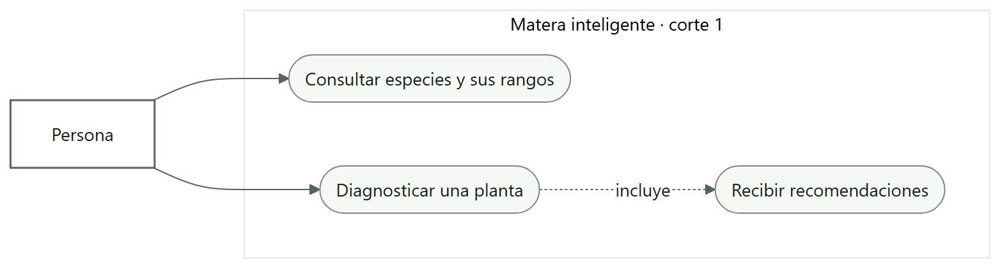

Fuente: [`casos-de-uso-corte1.mmd`](casos-de-uso-corte1.mmd).

- Hay un solo actor, anónimo, con dos casos: consultar las especies con sus rangos (RF5) y diagnosticar una planta (RF1 a RF4).
- Las recomendaciones no son un caso aparte: vienen incluidas en cada diagnóstico.

### Corte 2

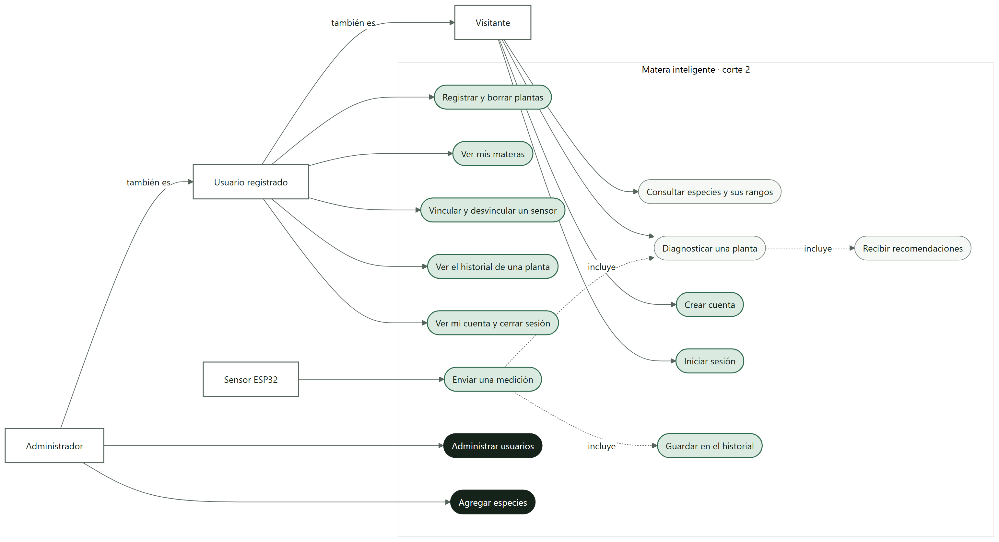

Fuente: [`casos-de-uso-corte2.mmd`](casos-de-uso-corte2.mmd).

- **Cuatro actores.** El *visitante* es la persona anónima del corte 1, que ahora además puede crear una cuenta e iniciar sesión. El *usuario registrado* también es visitante. El *administrador* también es usuario, y por eso también tiene plantas. El *sensor ESP32* es un actor sin persona.
- **El sensor no tiene su propia lógica de diagnóstico.** «Enviar una medición» *incluye* «Diagnosticar una planta», el mismo caso de uso del corte 1, e incluye «Guardar en el historial».
- **Casos exclusivos del administrador:** «Administrar usuarios» agrupa listar, desactivar y reactivar, dar y quitar el rol de admin, y eliminar cuentas. «Agregar especies» solo lo puede hacer el admin.

## Paquetes

### Corte 1

Fuente: [`paquetes.mmd`](paquetes.mmd).

- Cada caja es una carpeta real del repositorio y lista todos sus archivos, menos los `__init__.py`.
- Las flechas continuas son `import` del código de producción, en la dirección de la dependencia. Se sacaron leyendo los imports de cada archivo, no a mano.
- Las flechas punteadas son `main.py`, que arma todas las capas, y las pruebas.
- Ninguna flecha sale de `dominio/`.

### Corte 2

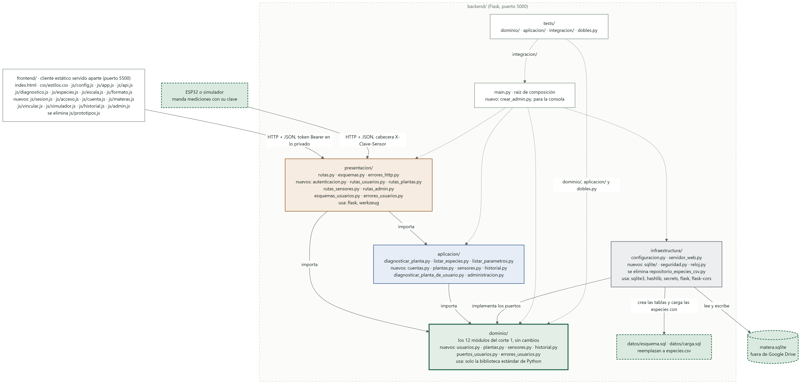

Fuente: [`paquetes-corte2.mmd`](paquetes-corte2.mmd).

- **Las flechas entre capas son las mismas del corte 1.** El corte 2 no agrega ninguna dependencia nueva entre capas: cambia el contenido de cada carpeta.
- Cada caja separa lo que ya estaba de lo `nuevo:` y de lo que `se elimina`. El dominio conserva sus 12 módulos sin cambios.
- **Hay una segunda entrada:** el ESP32, o el simulador del front, llega a la capa de presentación igual que el front, pero con su clave en la cabecera `X-Clave-Sensor` en lugar del token.
- **`especies.csv` desaparece.** En su lugar están `esquema.sql` y `carga.sql`, y la base `matera.sqlite`, que vive fuera de Google Drive (se configura con `MATERA_RUTA_BD`).
- `crear_admin.py` es una segunda raíz de composición, para la consola, igual que `main.py` lo es para la web.

## Clases

Son cuatro diagramas, porque en uno solo no se leían las más de 60 clases. Juntan el diagrama de clases que Roger armó en PlantUML (commits `3987f72` y `6c43769`) con el diseño del corte 2.

| Se tomó del diagrama de Roger | Se tomó del diseño o se corrigió contra el código |
|---|---|
| Las capas como paquetes con color | Los nombres exactos del código (`minimo_fisico`, `fuera_de_rango`…) |
| Presentación e infraestructura dentro del diagrama | `Medicion` con `1..*` lecturas; `Especie` compuesta por sus `Rango`; retornos «o None» |
| La nota con los errores del dominio | Las flechas que faltaban: `ResultadoParametro → Rango` y `esquemas → Medicion` |
| Las dependencias por constructor, con el nombre del rol (`regla`, `evaluador`, `servicio`) | Las clases del corte 2 dentro de su capa, no en un paquete «usuarios» aparte |
| `ReglaAgregacion` como interfaz, y la reutilización de `ServicioDiagnostico` destacada | El formato Mermaid del resto de la carpeta, con SVG y PNG |

En estos diagramas los colores van en líneas `style`, una por clase. Mermaid acepta `classDef` y `cssClass` en diagramas de clases, pero no los dibuja.

### Clases del dominio

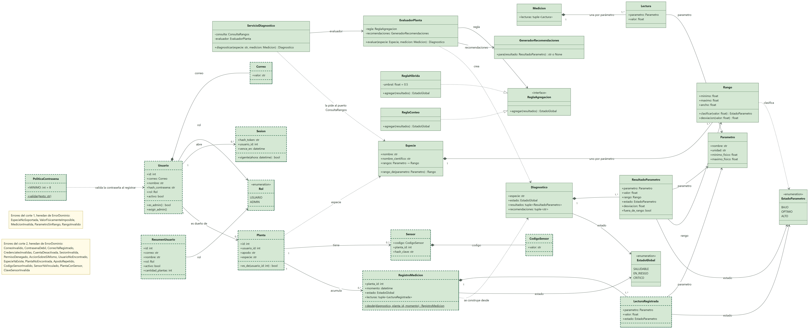

Fuentes: [`clases-dominio.mmd`](clases-dominio.mmd) (los dos cortes) y [`clases-dominio-corte1.mmd`](clases-dominio-corte1.mmd) ([imagen](clases-dominio-corte1.png), solo el corte 1).

- **A la derecha, el núcleo del corte 1.** `ServicioDiagnostico` usa a `EvaluadorPlanta`, que aplica una `ReglaAgregacion` (la híbrida o la de conteo) y el `GeneradorRecomendaciones` a una `Especie` y una `Medicion`, y crea un `Diagnostico`.
- **A la izquierda, lo nuevo.** `Usuario` con su `Rol`, `Sesion`, `Planta`, `Sensor` con su `CodigoSensor`, y `RegistroMedicion` para el historial.
- **Ninguna flecha sale de una clase del corte 1 hacia una nueva.** Son las nuevas las que dependen de las viejas: `Planta` apunta a `Especie` y `RegistroMedicion` se construye desde un `Diagnostico`. Por eso el corte 2 no modifica ningún módulo del dominio actual.
- **`Usuario.exigir_admin()` es la regla de permisos de todo el sistema.** Si el usuario no es ADMIN, lanza `PermisoDenegado`.
- Las dos notas amarillas listan los errores de cada corte. Todos heredan de `ErrorDominio`.

### Puertos e implementaciones

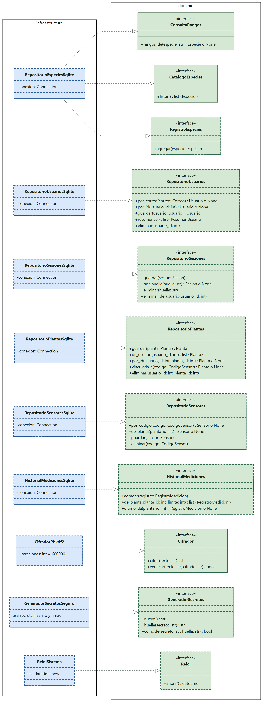

Fuentes: [`clases-puertos.mmd`](clases-puertos.mmd) y [`clases-puertos-corte1.mmd`](clases-puertos-corte1.mmd) ([imagen](clases-puertos-corte1.png)).

- **Todas las flechas van de infraestructura hacia el dominio (RA5, DIP).** El dominio declara la interfaz, e infraestructura la implementa.
- En el corte 1 hay dos puertos, `ConsultaRangos` y `CatalogoEspecies`, y los implementa `RepositorioEspeciesCsv`. En el corte 2 hay once.
- **`RepositorioEspeciesSqlite` reemplaza al CSV.** Implementa los mismos dos puertos más `RegistroEspecies`, el que usa el admin para agregar especies. Es el escenario 5.2 del documento: una clase nueva y ningún cambio en el dominio.
- **`RepositorioPlantas` solo encuentra una planta de dos formas:** por su dueño, `por_id(usuario_id, planta_id)`, o por un sensor ya autenticado, `vinculada_a(codigo)`. Ahí vive el aislamiento entre usuarios.
- `Cifrador`, `GeneradorSecretos` y `Reloj` son puertos para que el dominio y la aplicación no importen `hashlib`, `secrets` ni la hora del sistema. En las pruebas, cada interfaz tiene un doble en memoria.

### Presentación y aplicación: diagnóstico, plantas y sensores

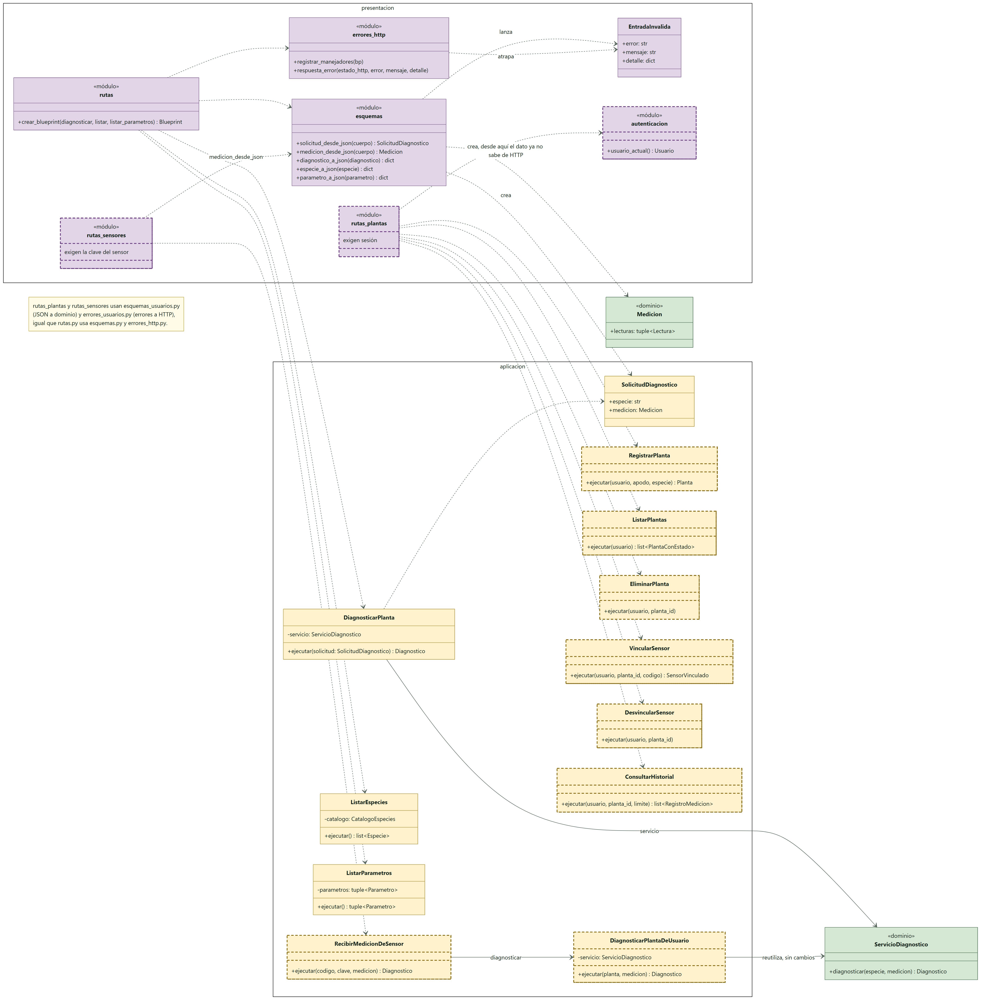

Fuentes: [`clases-aplicacion.mmd`](clases-aplicacion.mmd) y [`clases-aplicacion-corte1.mmd`](clases-aplicacion-corte1.mmd) ([imagen](clases-aplicacion-corte1.png)).

- **Las rutas públicas del corte 1 no cambian.** `rutas` llama a `DiagnosticarPlanta`, `ListarEspecies` y `ListarParametros`.
- **`esquemas` crea la `Medicion`.** Esa es la línea donde el dato deja de saber que llegó por HTTP (RA6). En el corte 2 se extrae `medicion_desde_json()` para que la use también `rutas_sensores`.
- `rutas_plantas` exige sesión a través de `autenticacion`. `rutas_sensores` no usa el token: el sensor se identifica con su propia clave.
- **La reutilización del núcleo:** `RecibirMedicionDeSensor → DiagnosticarPlantaDeUsuario → ServicioDiagnostico`, el mismo servicio del corte 1, sin cambios.

### Presentación y aplicación: cuentas y administración

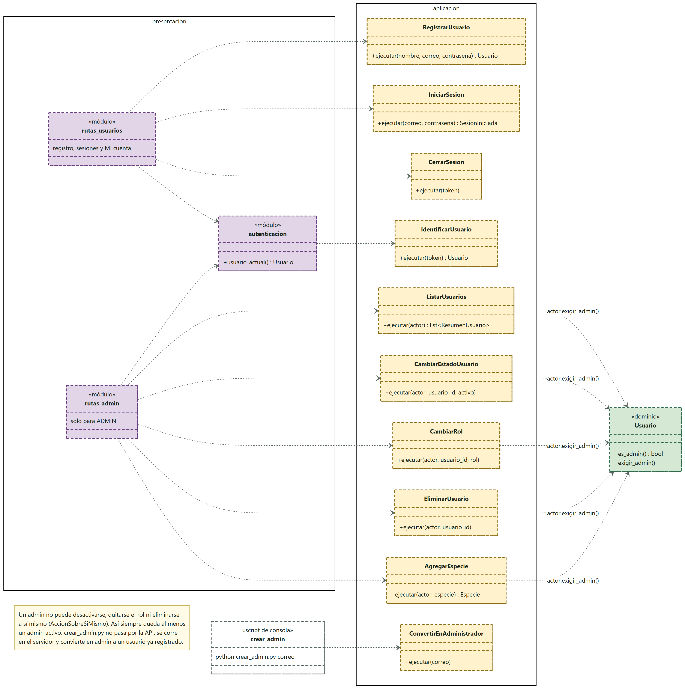

Fuente: [`clases-cuentas.mmd`](clases-cuentas.mmd). Solo existe en el corte 2.

- `rutas_usuarios` maneja el registro, las sesiones y «Mi cuenta». `rutas_admin` maneja todo lo que es solo para el admin, bajo `/api/v1/admin`.
- **Cada caso de uso de administración llama primero a `actor.exigir_admin()`.** La ruta no revisa el rol, y esconder la pestaña en el front no protege nada: la regla está en el dominio.
- **Siempre queda al menos un admin**, porque un admin no puede desactivarse, quitarse el rol ni eliminarse a sí mismo.
- `crear_admin` es el script de consola que crea el primer administrador. No pasa por la API.

Qué puertos usa cada caso de uso nuevo (en negrita, lo que ya existía en el corte 1):

| Caso de uso | Archivo en `aplicacion/` | Depende de |
|---|---|---|
| `RegistrarUsuario` | `cuentas.py` | RepositorioUsuarios, Cifrador |
| `IniciarSesion` | `cuentas.py` | RepositorioUsuarios, RepositorioSesiones, Cifrador, GeneradorSecretos, Reloj |
| `CerrarSesion` | `cuentas.py` | RepositorioSesiones, GeneradorSecretos |
| `IdentificarUsuario` | `cuentas.py` | RepositorioSesiones, RepositorioUsuarios, GeneradorSecretos, Reloj |
| `RegistrarPlanta` | `plantas.py` | RepositorioPlantas, **ConsultaRangos** |
| `ListarPlantas` | `plantas.py` | RepositorioPlantas, RepositorioSensores, HistorialMediciones |
| `EliminarPlanta` | `plantas.py` | RepositorioPlantas |
| `VincularSensor` | `sensores.py` | RepositorioPlantas, RepositorioSensores, GeneradorSecretos |
| `DesvincularSensor` | `sensores.py` | RepositorioPlantas, RepositorioSensores |
| `RecibirMedicionDeSensor` | `sensores.py` | RepositorioSensores, RepositorioPlantas, GeneradorSecretos, DiagnosticarPlantaDeUsuario |
| `DiagnosticarPlantaDeUsuario` | `diagnosticar_planta_de_usuario.py` | **ServicioDiagnostico**, HistorialMediciones, Reloj |
| `ConsultarHistorial` | `historial.py` | RepositorioPlantas, HistorialMediciones |
| `ListarUsuarios` | `administracion.py` | RepositorioUsuarios |
| `CambiarEstadoUsuario` | `administracion.py` | RepositorioUsuarios, RepositorioSesiones |
| `CambiarRol` | `administracion.py` | RepositorioUsuarios |
| `EliminarUsuario` | `administracion.py` | RepositorioUsuarios |
| `AgregarEspecie` | `administracion.py` | **ConsultaRangos**, RegistroEspecies |
| `ConvertirEnAdministrador` | `administracion.py` | RepositorioUsuarios |

## Entidad-relación

### Corte 1

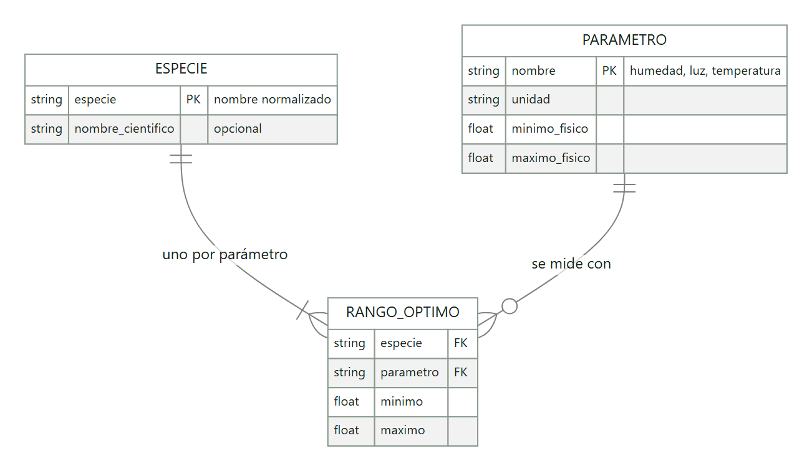

Fuente: [`entidad-relacion-corte1.mmd`](entidad-relacion-corte1.mmd).

- Es el modelo **conceptual**: en el corte 1 no hay base de datos. Físicamente es un solo archivo, `datos/especies.csv`, con una fila por especie y dos columnas (`_min` y `_max`) por parámetro.
- `PARAMETRO` no es una tabla sino las constantes de `dominio/parametros.py`.

### Corte 2

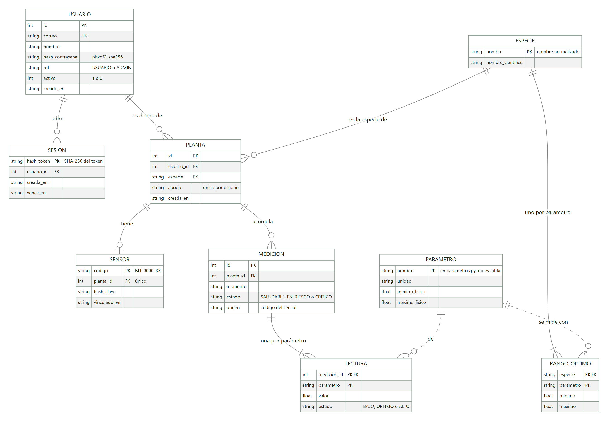

Fuente: [`entidad-relacion-corte2.mmd`](entidad-relacion-corte2.mmd).

- **Todo va en un solo archivo SQLite, con ocho tablas.** Cada usuario solo ve lo suyo porque cada planta tiene su `usuario_id`, y el puerto obliga a decir de quién es la planta que se busca.
- **`ESPECIE` y `RANGO_OPTIMO` reemplazan al CSV.** `carga.sql` las llena con las mismas especies, rangos y fuentes. Ahora `PLANTA.especie` es una llave foránea real: no se puede registrar una planta con una especie inexistente, ni borrar una especie que alguna planta use.
- **`RANGO_OPTIMO` y `LECTURA` guardan una fila por parámetro**, así que agregar el pH no cambia el esquema.
- `USUARIO.rol` es USUARIO o ADMIN, y `USUARIO.activo` permite desactivar una cuenta sin borrarla.
- `SENSOR` es 0..1 por planta y solo existe mientras está vinculado. `hash_clave` y `hash_token` guardan huellas, nunca el secreto.
- Borrar un usuario o una planta borra en cascada lo que depende de ellos. Las líneas punteadas llegan a `PARAMETRO`, que sigue en el código.

## Secuencias

### Secuencia de un diagnóstico

Fuente: [`secuencia-diagnostico.mmd`](secuencia-diagnostico.mmd).

Sigue una petición desde que la persona escribe en el front hasta que se pinta el resultado, con las funciones y clases reales. También muestra las dos salidas de error: 400 por entrada inválida y 404 por especie inexistente.

En el corte 2 este recorrido no cambia. La única diferencia es el participante `P`: en vez de `RepositorioEspeciesCsv` estará `RepositorioEspeciesSqlite`, detrás del mismo puerto `ConsultaRangos`.

### Secuencia de una medición del sensor

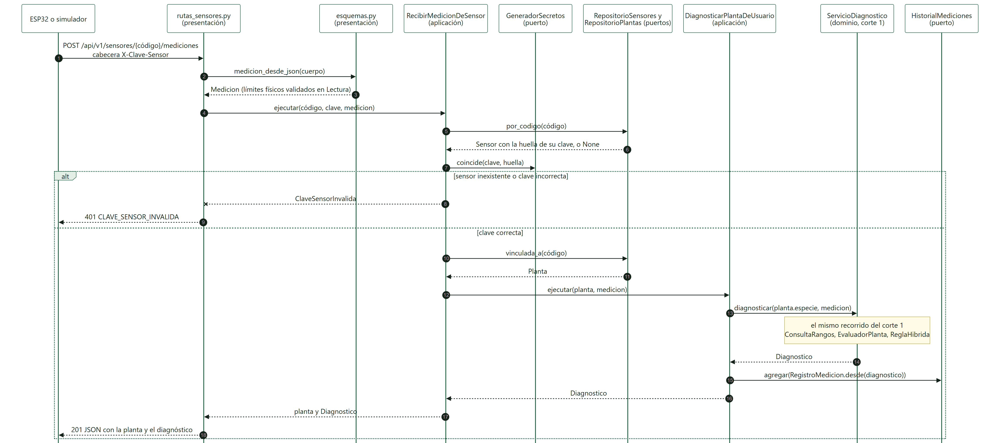

Fuente: [`secuencia-medicion-sensor.mmd`](secuencia-medicion-sensor.mmd). Corte 2.

- **HTTP termina en `rutas_sensores.py`.** De ahí en adelante viajan un código, una clave y una `Medicion`, y los límites físicos ya se validaron al crear cada `Lectura`.
- **El sensor se identifica con su clave.** `GeneradorSecretos.coincide()` la compara con la huella guardada. Un sensor inexistente y una clave incorrecta dan el mismo 401, para no revelar qué códigos existen.
- La planta se obtiene con `vinculada_a(código)`, porque el sensor ya se autenticó.
- **`ServicioDiagnostico` es el del corte 1, sin cambios.** El resultado se guarda como `RegistroMedicion`, con el estado que tenía en ese momento.
- Con MQTT solo cambiarían el primer participante y el adaptador que lo recibe. Desde `RecibirMedicionDeSensor` en adelante, todo queda igual.

### Secuencia de login y «mis plantas»

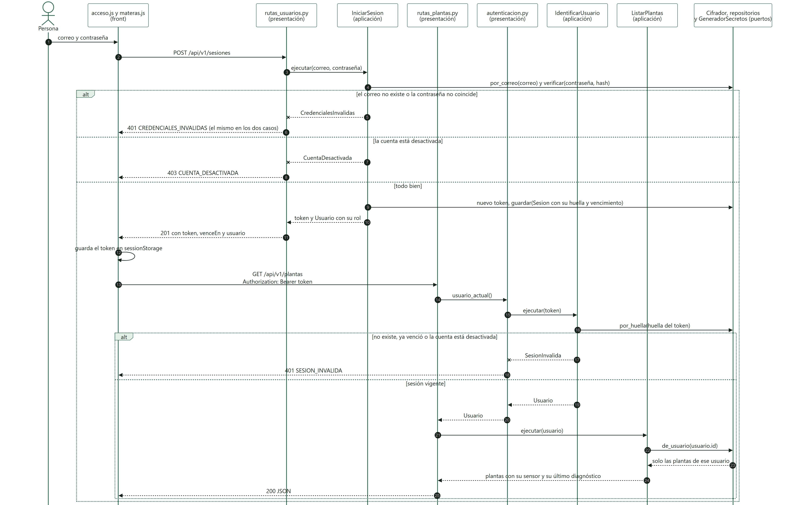

Fuente: [`secuencia-login.mmd`](secuencia-login.mmd). Corte 2.

- Si el correo no existe o la contraseña no coincide, la respuesta es el mismo 401. Una cuenta desactivada da 403, pero solo después de que la contraseña fue correcta.
- El token se devuelve una sola vez; la base guarda solo su huella y su vencimiento. El front lo guarda en `sessionStorage`.
- **`autenticacion.py` es la línea donde el token deja de saber que existe HTTP:** saca el texto de la cabecera y a `IdentificarUsuario` solo le pasa un `str`.
- `ListarPlantas` recibe el `Usuario` y el repositorio solo devuelve sus plantas.

### Secuencia del admin que agrega una especie

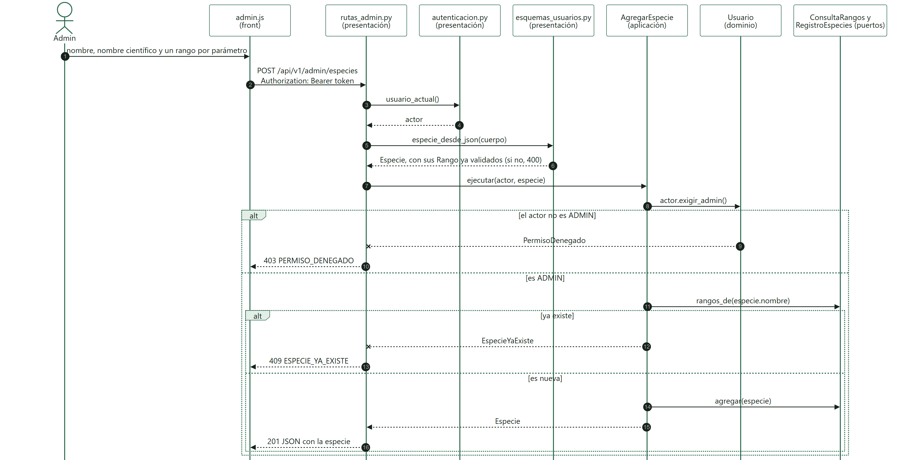

Fuente: [`secuencia-admin-especie.mmd`](secuencia-admin-especie.mmd). Corte 2.

- **El permiso se revisa en el caso de uso, con `actor.exigir_admin()`.** Si el actor no es admin, la respuesta es 403, venga del front o de cualquier otro cliente.
- La especie se arma con las mismas clases `Especie` y `Rango` del corte 1. Un rango con el mínimo mayor o igual que el máximo se rechaza con 400 antes de llegar al caso de uso.
- Si la especie ya existe, la respuesta es 409. Si no, se guarda con `RegistroEspecies` y aparece de inmediato en `GET /especies`, disponible para las plantas de cualquier usuario.

---

## Si cambia el código

Los diagramas del corte 1 tienen que seguir correspondiendo uno a uno con el repositorio. Si se agrega, se renombra o se mueve un archivo, o cambia un import entre capas:

1. Edite el `.mmd`.
2. Pegue su contenido en <https://mermaid.live> y exporte el SVG y el PNG con el mismo nombre. También se puede exportar con `npx @mermaid-js/mermaid-cli -i paquetes.mmd -o paquetes.svg`.

Mientras se implementa el corte 2:

- Cuando una clase del corte 2 ya tenga código, quite `stroke-dasharray` de su línea `style` en los diagramas de clases.
- Cuando el corte 2 esté completo, los archivos `-corte2` pasan a ser los vigentes. Los `-corte1` quedan como registro del antes.
