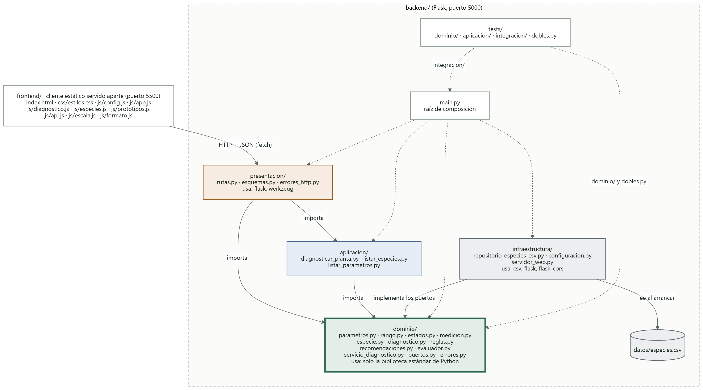
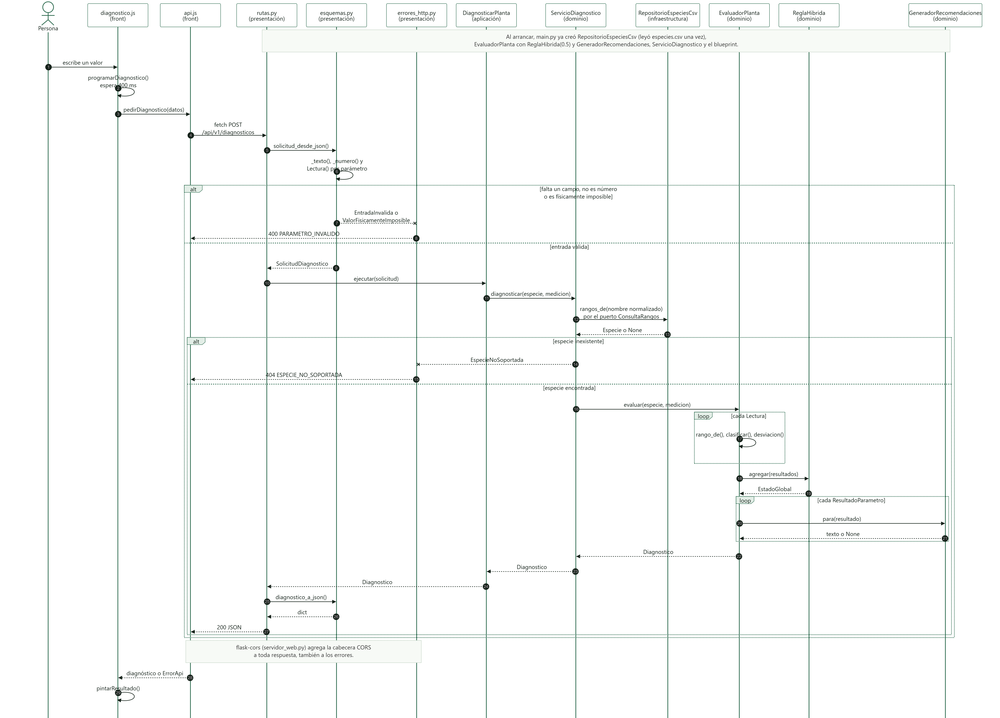

# Diagramas

La fuente de cada diagrama es su archivo `.mmd` (Mermaid). El `.svg` y el `.png` son exportaciones de esa fuente, listas para pegar en el documento.

## Paquetes

Fuente: [`paquetes.mmd`](paquetes.mmd).

- Cada caja es una carpeta real del repositorio y lista todos sus archivos, menos los `__init__.py`.
- Las flechas continuas son `import` del código de producción, en la dirección de la dependencia. Se sacaron leyendo los imports de cada archivo, no a mano.
- Las flechas punteadas son `main.py`, que arma todas las capas, y las pruebas.
- Ninguna flecha sale de `dominio/`.

## Secuencia de un diagnóstico

Fuente: [`secuencia-diagnostico.mmd`](secuencia-diagnostico.mmd).

Sigue una petición desde que la persona escribe en el front hasta que se pinta el resultado, con las funciones y clases reales. También muestra las dos salidas de error: 400 por entrada inválida y 404 por especie inexistente.

## Si cambia el código

Estos diagramas tienen que seguir correspondiendo uno a uno con el repositorio. Si se agrega, se renombra o se mueve un archivo, o cambia un import entre capas:

1. Edite el `.mmd`.
2. Pegue su contenido en <https://mermaid.live> y exporte el SVG y el PNG con el mismo nombre. También se puede exportar con `npx @mermaid-js/mermaid-cli -i paquetes.mmd -o paquetes.svg`.
